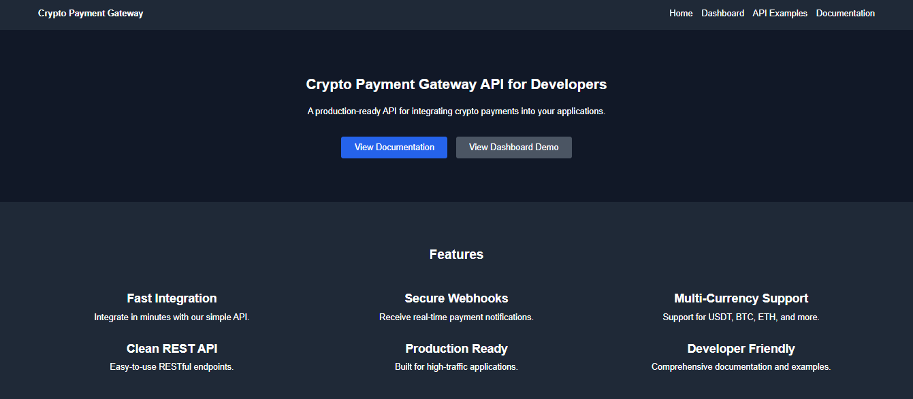
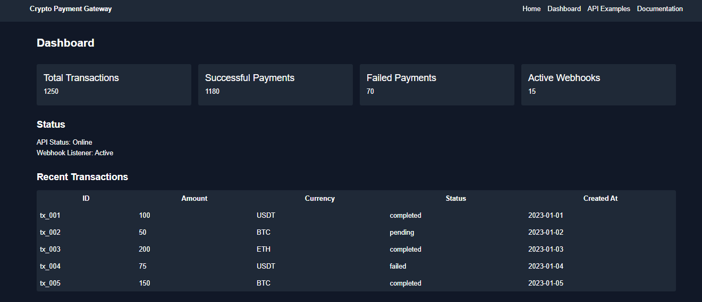
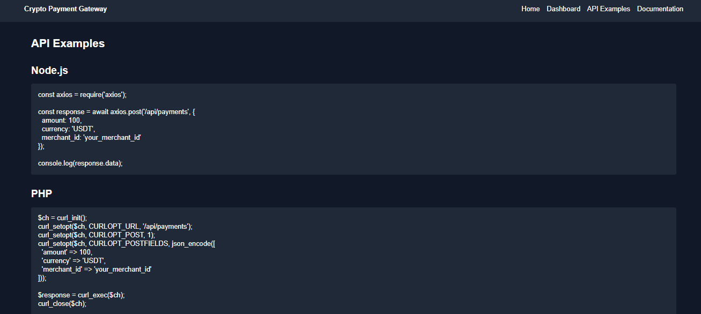
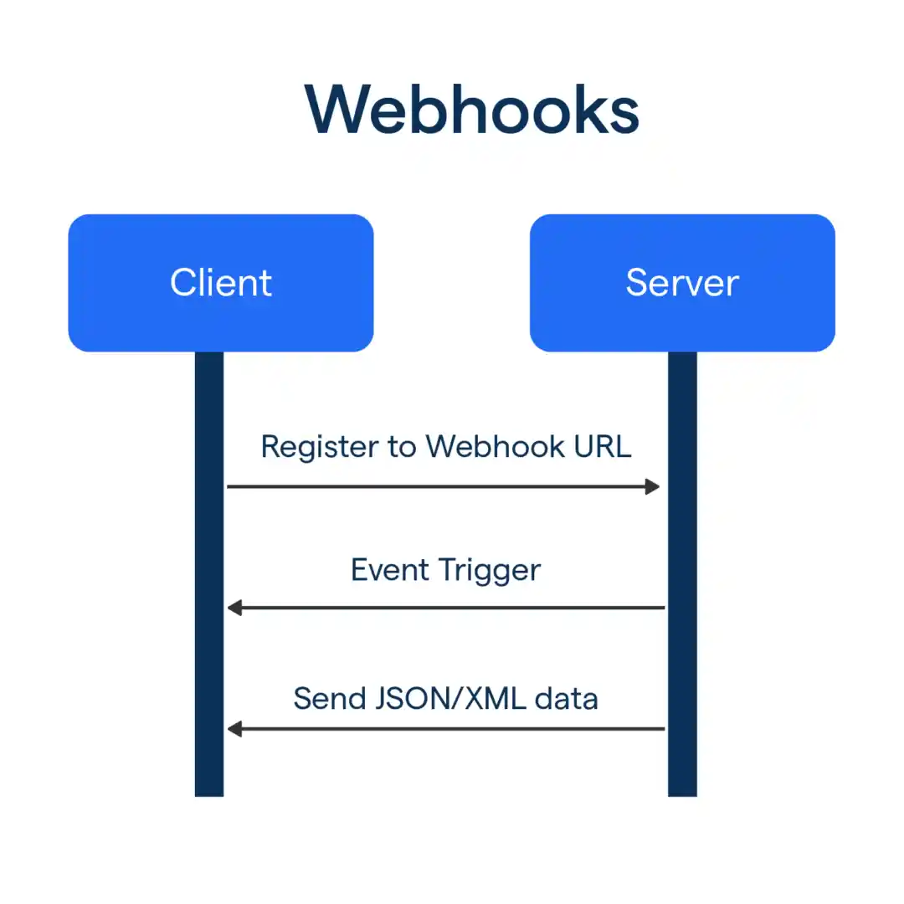
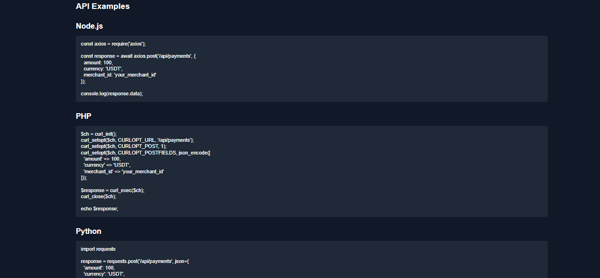
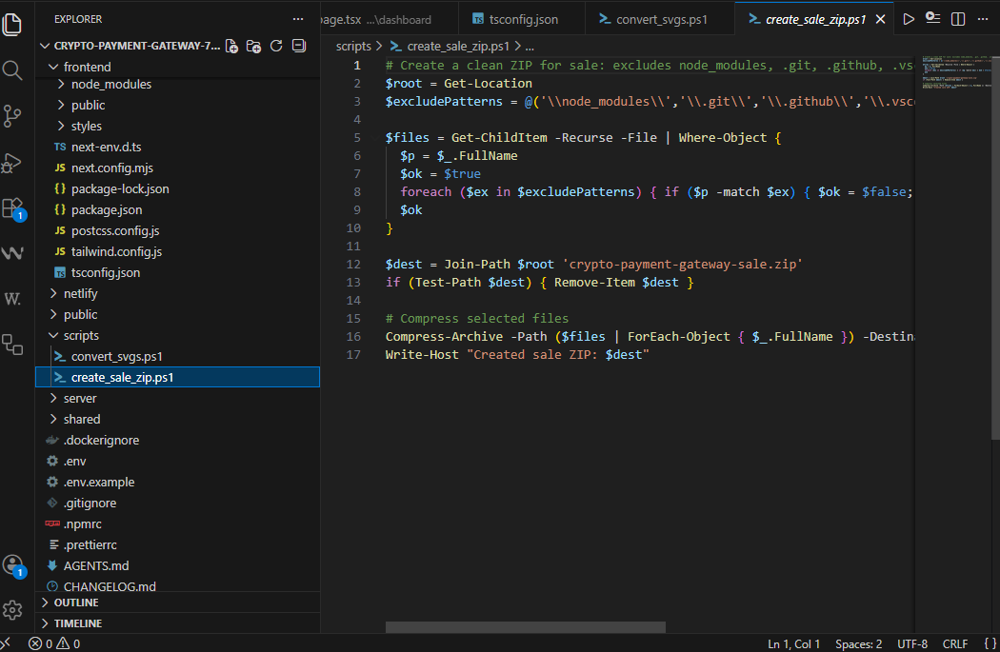
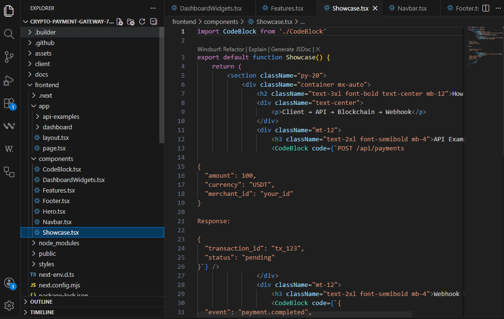
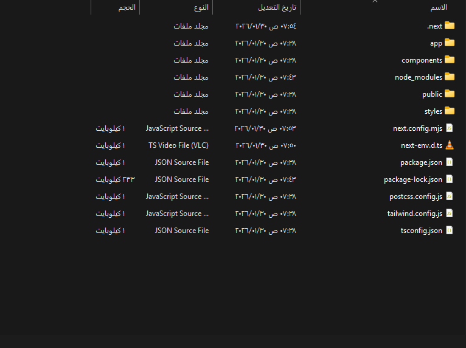

# 🚀 Crypto Payment Gateway API for Developers



**Production-ready API for integrating crypto payments into your applications.**  
Secure, fast, and developer-friendly — built for real-world use.

---

## 🏆 Features

- ⚡ **Fast Integration** — Plug & play REST API with clear documentation  
- 🔐 **Secure Webhooks** — Verified callbacks with crypto-safe payloads  
- 🌐 **Multi-Currency Support** — USDT, BTC, ETH, and more  
- 🧪 **Clean JSON Responses** — Developer-friendly formatting  
- 📦 **Ready for Production** — Stable, tested, and documented



---

## 📸 Showcase

### 🔹 API Example

```http
POST /api/payments
{
  "amount": 100,
  "currency": "USDT",
  "merchant_id": "your_id"
}
```

Response:

```json
{
  "transaction_id": "tx_123",
  "status": "pending"
}
```



---

### 🔹 Webhook Example

```json
{
  "event": "payment.completed",
  "transaction_id": "tx_123",
  "amount": 100,
  "currency": "USDT"
}
```



---

## 📊 Dashboard Preview


- Real-time stats  
- Transaction table  
- Webhook status  
- Charts (mock data)

---

## 🧱 Project Structure

Organized for clarity and scalability.


---

## 💻 Code Samples

### Node.js  


### PHP  


### Python  


---

## 📦 What’s Included

- ✅ Full API source code (Node.js / Express)  
- ✅ Frontend demo (Next.js + Tailwind)  
- ✅ Documentation files (Markdown)  
- ✅ Screenshots  
- ✅ Installation guide  
- ✅ License file  
- ✅ README (this file)

---

## 📥 Installation

```bash
# Backend
cd backend
npm install
npm run dev

# Frontend
cd frontend
npm install
npm run dev
```

---

## ❓ FAQ

**هل يمكنني استخدامه في مشروع SaaS؟**  
نعم، الكود قابل للتوسعة ويعمل كقاعدة قوية لأي مشروع SaaS.

**هل يدعم العملات المتعددة؟**  
نعم، يدعم USDT وBTC وETH ويمكنك إضافة المزيد بسهولة.

**هل يحتوي على Webhook؟**  
نعم، مع نظام تحقق آمن ومُوثّق بالكامل.

---

## 📄 License

This project is licensed under the MIT License.  
See `LICENSE.txt` for details.

---

## 📣 Why Choose This API?

- Built by developers, for developers  
- Clean structure, easy to extend  
- Real screenshots, real code  
- Ready for CodeCanyon, Codester, Payhip, Gumroad

---

## 🔗 Documentation

- 
- 
-   
- 

---

## 💬 Support

For questions or custom integration, contact:  
**Yahia — yhiaali@gmail.com**

---

## 🚀 Ready to Launch?

This product is ready for sale.  
Use it, extend it, or integrate it into your next crypto-powered app.

## 📚 Technical Documentation

Looking for full API reference and developer setup?

👉 See [README.dev.md](./README.dev.md)